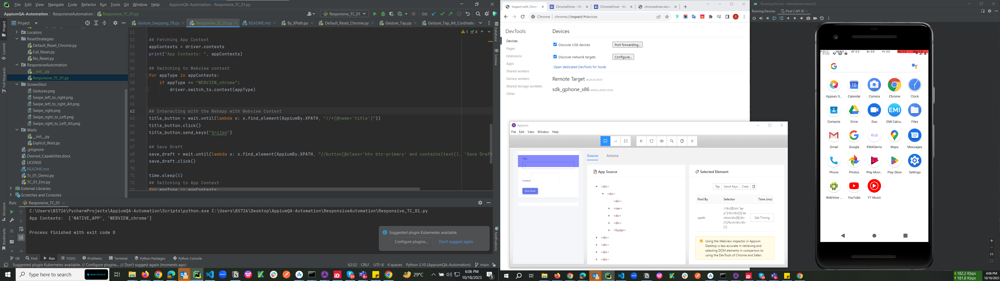

    
# Application Automation With Appium Pyhton
<code></code>
<code></code>
<code></code>
<code></code>
<code></code>

## :ledger: Index

- [About](#beginner-about)
- [Usage](#zap-usage)
  - [Installation](#electric_plug-installation)
  - [Commands](#package-commands)
- [Development](#wrench-development)
  - [Pre-Requisites](#notebook-pre-requisites)
  - [Developmen Environment](#nut_and_bolt-development-environment)
  - [File Structure](#file_folder-file-structure)
  - [Build](#hammer-build)  
  - [Deployment](#rocket-deployment)  
- [Community](#cherry_blossom-community)
  - [Contribution](#fire-contribution)
  - [Branches](#cactus-branches)
  - [Guideline](#exclamation-guideline)  
- [FAQ](#question-faq)
- [Resources](#page_facing_up-resources)
- [Gallery](#camera-gallery)
- [Credit/Acknowledgment](#star2-creditacknowledgment)
- [License](#lock-license)

##  :beginner: About
In order to diversify machine language and automation framework I have initiated this repo. Appium has always been a major tool for Android/iOS Application Automation. The tool and the language are quite an unfamiliar combination but lets try out anyways. 


## :zap: Usage
Write about how to use this project.

###  :electric_plug: Installation
- Steps on desired capabilities to invoke the APK applications.
###  :package: Desired Capabilities for Demo Application

- Android Demo
```
{
  "deviceName": "Android Emulator",
  "platformName": "Android",
  "appPackage": "com.code2lead.kwad",
  "appActivity": "com.code2lead.kwad.MainActivity",
  "app": "C:\\Users\\BS726\\Desktop\\AppiumQA-Automation\\Demo APK\\Android_Demo_App.apk",
  "appWaitDuration": "20000"
}

```
###  :package: Desired Capablities for Emi Calculator Application
- Emi Calculator
```
{
  "deviceName": "Android Emulator",
  "platformName": "Android",
  "appPackage": "com.continuum.emi.calculator",
  "appWaitActivity": "com.finance.emicalci.activity.Splash_screnn",
  "app": "C:\\Users\\BS726\\Desktop\\AppiumQA-Automation\\Demo APK\\emi-calculator.apk",
  "appWaitDuration": "20000"
}

```
###  :package: Appium Port Kill Command
- Port Find
```
netstat -ano | findstr :4723
```
- Port Kill
```
taskkill /F /PID <PID>
```
###  :package: Chrome Responsive Automation
- Chrome Responsive Automation
```
{
  "deviceName": "Android Emulator",
  "platformName": "Android",
  "appPackage": "com.code2lead.kwad",
  "appActivity": "com.code2lead.kwad.MainActivity",
  "app": "C:\\Users\\BS726\\Desktop\\AppiumQA-Automation\\Demo APK\\Android_Demo_App.apk",
  "appWaitDuration": "20000"
}

```
###  :package: Pytest Installation
- Installing Pytest
```
pip3 install pytest
```
###  :exclamation: Pytest Run Order Installation
- Installing Pytest Run Order -- Deprecated Package not maintained
```
pip3 install pytest-ordering
```
###  :package: Pytest Re-Run Failures
- Installing Pytest Re-Rerun Failures
```
pip3 install pytest-rerunfailures
```
###  :package: Pytest Test Run Terminal Command
- Run your Test Script From the Terminal 
```
python -m pytest test_Pytest_rerun.py

```
###  :package: Allure Report Installation
- Installation of Allure Report
```
pip install pytest-allure

```
###  :package: Generating Allure Result
- Allure Result Generation
```
python -m pytest test_Pytest_Responsive.py --alluredir allure-results 

``` 
###  :package: Generating Allure Report
- Allure HTML Report Generation
```
allure generate allure-report -o allure-report-html

```
###  :package: Starting Allure Server to Generate Report
- Allure Report Serving
```
allure serve allure-results

```
###  :package: Installing Requirements 
- Installing All Available Requirements
```
pip3 install -r ...\RequirementSetUp.txt

```
pip3 install -r C:\Users\BS726\Desktop\AppiumQA-Automation\RequirementSetUp.txt


##  :wrench: Development
If you want to colab please read through. 

### :notebook: Pre-Requisites
List of all the pre-requisites the system needs to develop this project.
- Android Studio Emulator
- Appium
- Appium-Python-Client
- Allure Reports

###  :nut_and_bolt: Development Environment
Write about setting up the working environment for your project.
- How to download the project...
- How to install dependencies...


###  :file_folder: File Structure
File Structure to navigate the project.

```
.
├── assets
│   ├── css
│   │   ├── index-ui.css
│   │   └── rate-ui.css
│   ├── images
│   │   ├── icons
│   │   │   ├── shrink-button.png
│   │   │   └── umbrella.png
│   │   ├── logo_144.png
│   │   └── Untitled-1.psd
│   └── javascript
│       ├── index.js
│       └── rate.js
├── CNAME
├── index.html
├── rate.html
└── README.md
```

| No | File Name | Details 
|----|------------|-------|
| 1  | index | Entry point

###  :hammer: Build
Write the build Instruction here.

### :rocket: Deployment
Write the deployment instruction here.

## :cherry_blossom: Community

If it's open-source, talk about the community here, ask social media links and other links.

 ###  :fire: Contribution

 Your contributions are always welcome and appreciated. Following are the things you can do to contribute to this project.

 1. **Report a bug** <br>
 If you think you have encountered a bug, and I should know about it, feel free to report it [here]() and I will take care of it.

 2. **Request a feature** <br>
 You can also request for a feature [here](), and if it will viable, it will be picked for development.  

 3. **Create a pull request** <br>
 It can't get better then this, your pull request will be appreciated by the community. You can get started by picking up any open issues from [here]() and make a pull request.

 > If you are new to open-source, make sure to check read more about it [here](https://www.digitalocean.com/community/tutorial_series/an-introduction-to-open-source) and learn more about creating a pull request [here](https://www.digitalocean.com/community/tutorials/how-to-create-a-pull-request-on-github).


 ### :cactus: Branches

 I am using an agile continuous integration methodology, so the version is frequently updated and development is really fast.

1. **`dev`** is the development branch.

2. **`stage`** is the experiment branch.

3. **`main`** is the stable branch for anyone to quickly run and learn about the project. 

4. No other permanent branches should be created in the main repository, you can create feature branches but they should not get merged with the main.

**Steps to work with feature branch**

1. To start working on a new feature, create a new branch prefixed with `feat` and followed by feature name. (ie. `feat-FEATURE-NAME`)
2. Once you are done with your changes, you can raise PR.

**Steps to create a pull request**

1. Make a PR to `stage` branch.
2. Comply with the best practices and guidelines e.g. where the PR concerns visual elements it should have an image showing the effect.
3. It must pass all continuous integration checks and get positive reviews.

After this, changes will be merged.


### :exclamation: Issues I faced 
- Port Kill 4723
- Desire Capabilities appPackage || appWaitActivity
- Find Element By Class Name
- Mark Test Run Ordering using pytest-ordering package (Deprecated)
- Pytest Rerun Command python -m pytest test_Pytest_rerun.py
- Webview Appview Context Switching with Pytest refer to test_Error_Handling.py file
- Start_Activity() depreciated (Dependency with appium Python Client package)

## :question: FYI
- Use a different Capabilities for Responsive Automation
- Use test_Example.py Naming Conventions inorder to run pytest based test scripts
- Use the -m path command given in the [Installation Section] or [Issues I Faced Section] to use it for pytest reruns

##  :page_facing_up: Resources

- For Android Key Codes
[ADB_Shell_Input_Events ](https://stackoverflow.com/questions/7789826/adb-shell-input-events)

- List of Selenium Exceptions
[Exceptions_in_Selenium](https://www.selenium.dev/selenium/docs/api/py/common/selenium.common.exceptions.html) 

- For Responsive Testing with Chrome Driver
[Chrome_Devices](chrome://inspect/#devices) 

- For Chrome Drivers
[Chrome_Drivers](https://chromedriver.chromium.org/downloads) 

- RunOrder Marking Documentation
[Marking](https://docs.pytest.org/en/stable/how-to/mark.html)

- Appium Python Client Documentation
[Start_Activity](https://pypi.org/project/Appium-Python-Client/)


##  :camera: Gallery


## :star2: Credit/Acknowledgment
Sujith Reddy

##  :lock: License
MIT